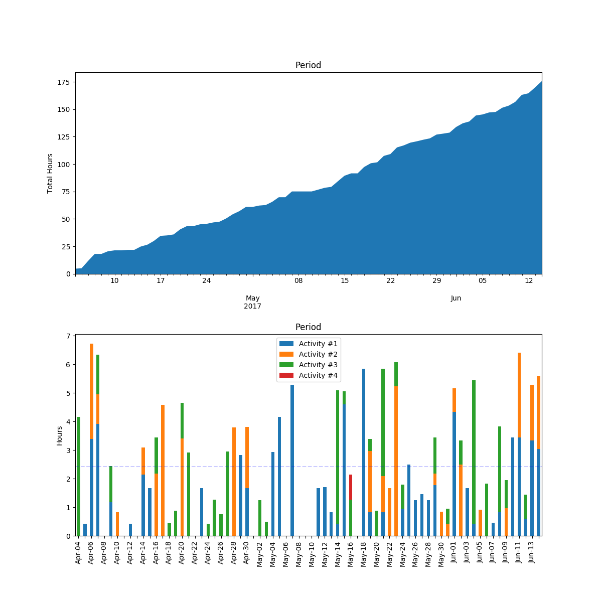

# org-pomodoro-grapher

This script plots pomodoro activity that has been recorded in Org mode via org-pomodoro. It is built to follow a specific hierarchical structure, so YMMV.

In practice, it simply stores information in a python dictionary and uses [pandas](http://pandas.pydata.org/) to plot a DataFrame.

